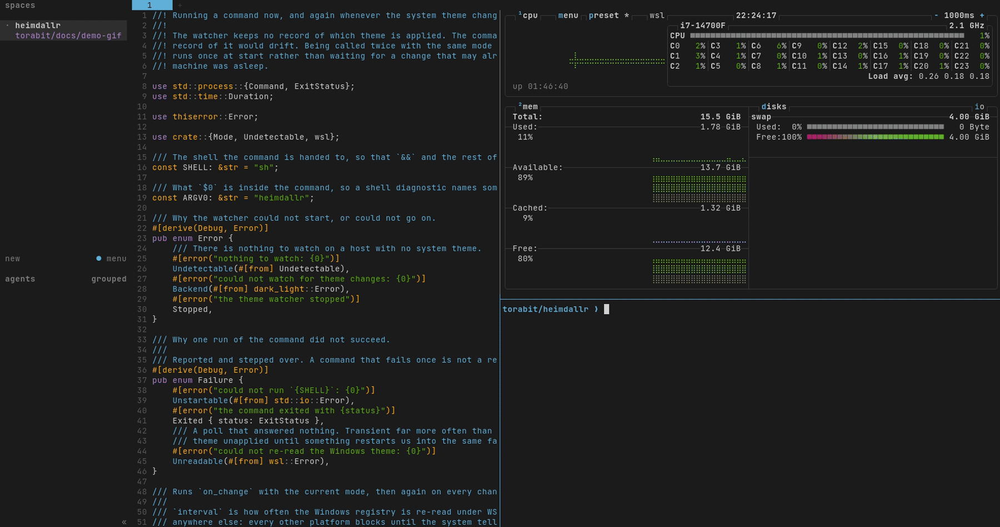

<h1 align="center">heimdallr</h1>

<p align="center">
  <a href="https://github.com/torabit/heimdallr/actions"
    ></a>
  <a href="https://crates.io/crates/heimdallr"
    ></a>
  <a href="https://github.com/torabit/heimdallr/blob/main/LICENSE-MIT"
    ></a>
</p>

Your terminal tools do not follow the system theme. The OS flips to dark at sunset and every
config file you own stays where it was, until you go and change them.

**heimdallr watches the system light/dark theme and runs a command when it changes.** What the
command does is up to you.

```sh
heimdallr watch --on-change 'vanadis apply --variant "$1"'
```

<p align="center">
  
</p>

That runs once now with the current mode, and again every time the OS flips. Ask it the mode
instead, and it answers in one word:

```console
$ heimdallr
dark
```

- **Four platforms.** macOS, Windows and Linux come from
  [`dark-light`](https://github.com/rust-dark-light/dark-light). WSL reads the Windows theme
  through `reg.exe`, which nothing else does.
- **It will not guess.** A host with no system theme exits non-zero and says so, instead of
  reporting `light` and sending you off to apply a theme nobody asked for.
- **One word on stdout.** `$(heimdallr)` is a bare `dark` or `light`. Everything else goes to
  stderr.
- **It catches up.** `watch` fires once at start rather than only on the next change, so a
  machine that was asleep or off across the transition is not left behind.

## Installation

```console
$ cargo install heimdallr
```

Or take a prebuilt binary from the [latest
release](https://github.com/torabit/heimdallr/releases/latest), which carries macOS, Linux and
Windows archives and an installer script for each.

From a clone:

```console
$ cargo build --release
```

## Keeping it running

heimdallr does not keep itself alive. It has no daemon mode, no PID file and no config file,
because systemd and launchd already do that and do it better. Copy one of these.

### systemd, on Linux and WSL

`~/.config/systemd/user/heimdallr.service`:

```ini
[Unit]
Description=Follow the system light/dark theme

[Service]
ExecStart=%h/.cargo/bin/heimdallr watch --on-change 'vanadis apply --variant "$1"'
Restart=on-failure
RestartSec=10

[Install]
WantedBy=default.target
```

```console
$ systemctl --user daemon-reload
$ systemctl --user enable --now heimdallr.service
```

`Restart=on-failure` matters. `watch` refuses to start when the mode cannot be read, which is
the right answer for a one-shot invocation and the wrong one for a unit that came up before the
thing it reads. Coming back in ten seconds costs nothing.

To see what it is doing, filter by the identifier rather than the unit — the command's own
output does not come back under `-u`:

```console
$ journalctl --user -t heimdallr -f
```

### launchd, on macOS

`~/Library/LaunchAgents/com.github.torabit.heimdallr.plist`:

```xml
<?xml version="1.0" encoding="UTF-8"?>
<!DOCTYPE plist PUBLIC "-//Apple//DTD PLIST 1.0//EN" "http://www.apple.com/DTDs/PropertyList-1.0.dtd">
<plist version="1.0">
<dict>
  <key>Label</key>
  <string>com.github.torabit.heimdallr</string>
  <key>ProgramArguments</key>
  <array>
    <string>/opt/homebrew/bin/heimdallr</string>
    <string>watch</string>
    <string>--on-change</string>
    <string>vanadis apply --variant "$1"</string>
  </array>
  <key>RunAtLoad</key>
  <true/>
  <key>KeepAlive</key>
  <true/>
  <key>StandardOutPath</key>
  <string>/tmp/heimdallr.log</string>
  <key>StandardErrorPath</key>
  <string>/tmp/heimdallr.log</string>
</dict>
</plist>
```

```console
$ launchctl bootstrap gui/$UID ~/Library/LaunchAgents/com.github.torabit.heimdallr.plist
```

## Under WSL

WSL is why this exists. Every cross-platform detector reaches for the XDG Desktop Portal, and
under WSL the portal knows nothing about the Windows theme. heimdallr reads the registry
through `reg.exe` instead.

It finds `reg.exe` through `/proc/mounts` when `PATH` does not have it, so nothing needs
adjusting in the unit file above. A `systemd --user` unit does not inherit the Windows
directories WSL appends to a login shell's `PATH`, and `[interop] appendWindowsPath = false` in
`/etc/wsl.conf` takes them away from the login shell too.

WSL is also the one platform that polls, because `reg.exe` has nothing to block on. `--interval`
sets how often and defaults to 30 seconds:

```sh
heimdallr watch --interval 60 --on-change 'vanadis apply --variant "$1"'
```

One read costs about 29 ms, so the default is around 0.1% of one core. The price is latency: a
switch lands up to one interval late, and for light and dark that is a fine trade. It is also
why no Windows-side helper is worth building. `--interval` is ignored everywhere else, where the
system says when the theme changed.

## What it does not do

**It holds no state.** The command owns which theme is applied. A second record of that would
drift, and being called twice with the same mode is harmless, so `watch` fires once at start
rather than waiting for a change it may already have missed while the machine was off.

**It does not manage its own process.** No daemon, no PID file, no log rotation, no config file.
See the unit files above.

**It does not follow the theme over ssh, and that is deliberate.** A headless host has no system
theme, so there is nothing to detect there. A remote session's colours come from the terminal,
which is local. Writing config files on the remote is the wrong shape: those files are
machine-global while a theme is per-session, so two clients in different modes cannot both be
right.

The answer is to let remote tools defer to the terminal's own ANSI palette:

```sh
export BAT_THEME=ansi
export FZF_DEFAULT_OPTS='--color=16'
```

That follows the local terminal automatically, per session, and needs nothing installed on the
server.

## What else there is

- [`darkman`](https://gitlab.com/WhyNotHugo/darkman) runs scripts on theme changes, on Linux
  only.
- [`dark-notify`](https://github.com/cormacrelf/dark-notify) does the same, on macOS only.
- Auto Dark Mode and PowerToys Light Switch *set* the Windows theme on a schedule rather than
  react to it.

Nothing covers WSL.

## License

MIT or Apache-2.0, at your option.
